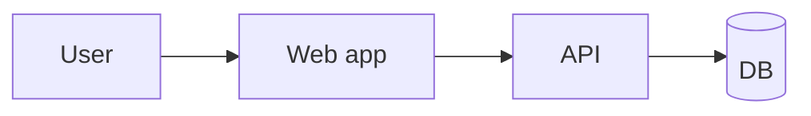

# Technical Plan

## Recap
-

## Stack
- Chosen:
- Alternatives considered:
- Why:

## Architecture



## Data / content model
-

## Security
-

## Observability
<!-- Logging, error tracking, alerting. An explicit "none for v1 — will notice failures via X" is a
     valid answer; an unfilled section is not. -->
-

## Repository map
```text
/
```

## Milestones
- M0 Scaffold
- M1 Vertical slice
- M2 Feature complete
- M3 Polish + harden

## Test strategy
-

## Local run / env
-

## Deploy notes
-

## Risks
-

## Definition of Done
-
